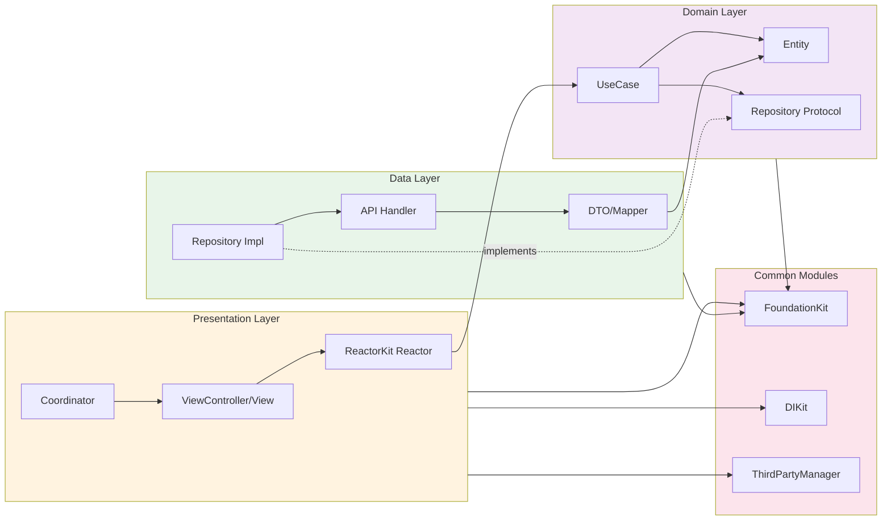
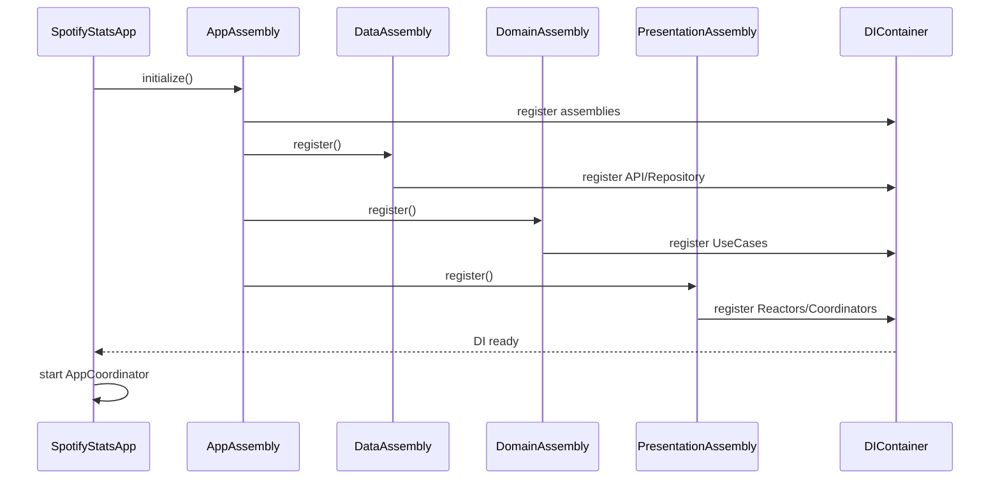
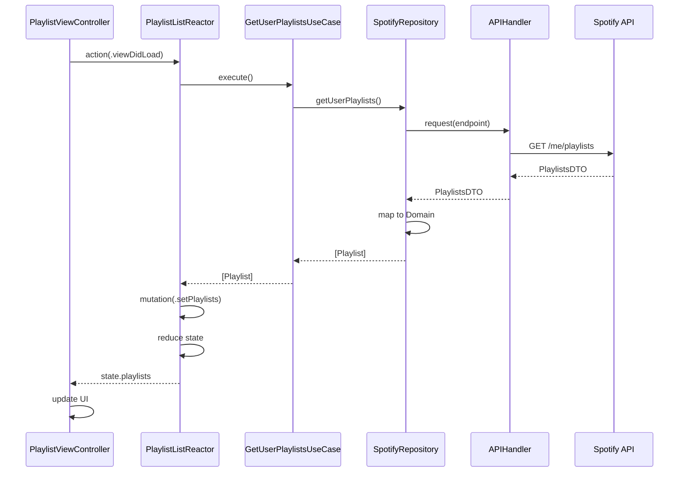
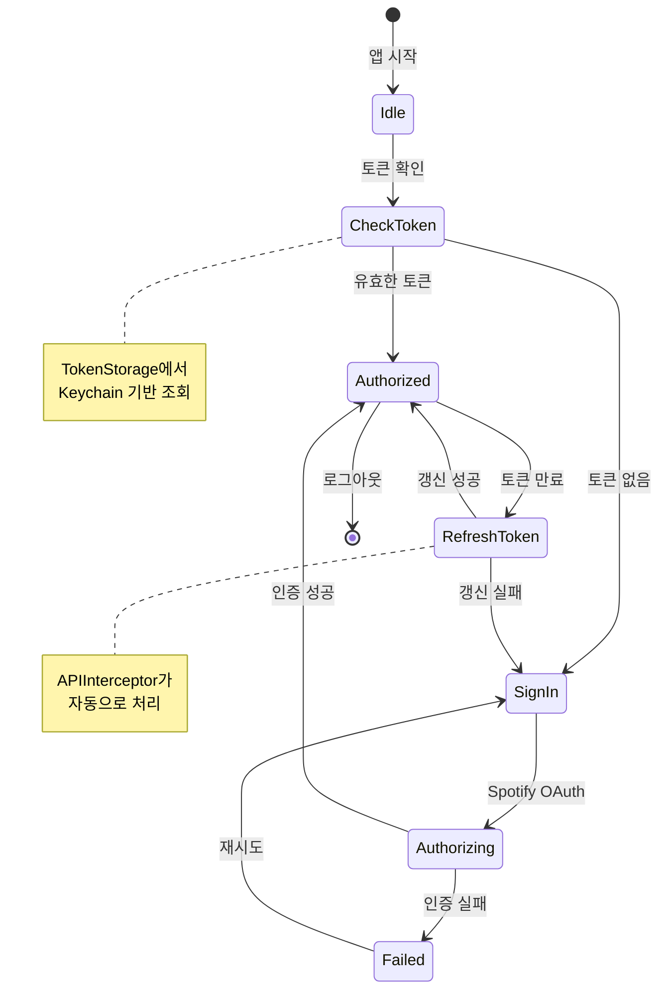

# SpotifyStats

SpotifyStats는 Spotify 청취 데이터를 분석하고 시각화하는 iOS 앱입니다. Tuist 기반의 멀티 모듈 아키텍처로 구성되어 있으며, ReactorKit · Rx 스택과 Swinject 기반 DI를 통해 화면과 비즈니스 로직을 명확하게 분리합니다.

## 목차
- [요구 사항](#요구-사항)
- [빠른 시작](#빠른-시작)
- [환경 구성](#환경-구성)
- [프로젝트 구조](#프로젝트-구조)
- [모듈 레이어](#모듈-레이어)
- [주요 기능](#주요-기능)
- [아키텍처 하이라이트](#아키텍처-하이라이트)
- [의존 라이브러리](#의존-라이브러리)
- [빌드 가이드](#빌드-가이드)
- [Tuist & 스크립트 활용](#tuist--스크립트-활용)
- [라이선스](#라이선스)

## 요구 사항
- macOS 13 Ventura 이상
- Xcode 15.0 이상, Swift 5.9 이상
- iOS 17.0 이상 타겟
- Tuist 4.x
- CocoaPods 미사용 · Swift Package Manager 기반

## 빠른 시작
```bash
# 의존성 가져오기 (최초 1회)
tuist fetch

# 워크스페이스 생성
tuist generate --no-open

# Tuist가 생성한 워크스페이스 열기
open SpotifyStats.xcworkspace
```

앱 실행 전 `BuildConfigurations/Debug.xcconfig` 또는 사용자 정의 xcconfig에 Spotify 자격 증명을 설정하세요. 퍼블릭값을 커밋하지 말고, 필요 시 `BuildConfigurations` 폴더를 참조해 개인 환경에서만 덮어쓰는 것을 권장합니다.

## 환경 구성
앱은 Info.plist를 통해 다음 키를 기대합니다. Tuist 프로젝트에서는 `BuildConfigurations/*.xcconfig`의 빌드 설정을 통해 주입됩니다.

| Key | 설명 |
| --- | --- |
| `SPOTIFY_CLIENT_ID` | Spotify Developer Dashboard에서 발급받은 Client ID |
| `SPOTIFY_API_BASE_URL` | Spotify REST API 기본 URL (기본값: `api.spotify.com/v1`) |
| `PRIVACY_POLICY_URL` | 개인정보 처리방침 URL |

> ⚠️ 운영 환경에서는 실제 민감 정보가 저장된 xcconfig를 별도 관리하세요. 버전에 포함된 기본 값은 샘플입니다.

## 프로젝트 구조
```
SpotifyStats/
├── Workspace.swift            # Tuist workspace 선언
├── Tuist.swift                # Tuist manifest 엔트리 포인트
├── Tuist/
│   ├── Package.swift          # Tuist용 SPM 의존성 정의
│   └── ProjectDescriptionHelpers/
│       ├── App.swift          # 애플리케이션 타깃 팩토리
│       ├── Framework.swift    # 공통 프레임워크 타깃 템플릿
│       ├── Project.swift      # 프로젝트 팩토리
│       └── *                  # 경로/스크립트 헬퍼 모음
├── BuildConfigurations/
│   ├── Debug.xcconfig
│   └── Release.xcconfig
├── Projects/
│   ├── Application/           # 앱 타깃
│   └── Modules/               # 레이어드 모듈
│       ├── DataKit/
│       ├── DomainKit/
│       ├── FoundationKit/
│       ├── PresentationKit/
│       ├── DIKit/
│       └── ThirdPartyManager/
├── Scripts/
│   ├── build.sh               # tuist generate + tuist build
│   └── install_template.sh    # 현재 프로젝트를 Tuist 템플릿으로 설치
├── graph.png                  # Tuist 그래프 스냅샷
└── README.md
```


## 모듈 레이어
| 모듈 | 책임 | 대표 타입 |
| --- | --- | --- |
| **Application** | 앱 엔트리 포인트, AppAssembly로 DI 부트스트랩, AppCoordinator를 통해 플로우 시작 | `SpotifyStatsApp`, `AppAssembly`, `AppCoordinator` |
| **PresentationKit** | UI · ReactorKit 계층, Coordinator, 상태 관리. Rx / ReactorKit, SnapKit, Kingfisher 기반 화면 구성 | `HomeReactor`, `StatisticsReactor`, `PlaylistCoordinator`, `SpotifyStateManager` |
| **DomainKit** | 비즈니스 엔티티와 UseCase 정의, Data 계층 추상화 | `GetTopTracksUseCase`, `GetUserPlaylistsUseCase`, `SpotifyRepository` 프로토콜 |
| **DataKit** | 네트워크 호출과 DTO → 도메인 매핑, Spotify REST 연동 | `APIHandler`, `APIInterceptor`, `SpotifyService`, `SpotifyRepositoryImpl`, `SpotifyPlaylistMapper` |
| **FoundationKit** | 공통 유틸리티, Keychain/TokenStorage, 로컬라이제이션 접근 | `AppConstants`, `TokenStorage`, `KeychainManager`, `String+Localization` |
| **DIKit** | Swinject 기반 경량 DI 래퍼, Assembly 등록/resolve 헬퍼 | `DIContainer`, `DIAssembly` |
| **ThirdPartyManager** | 외부 SDK 초기화/헬퍼, 플러그인 레이어 확장 포인트 | `ThirdPartyManagerModule` |

계층 의존성은 Presentation → Domain → Data 순으로 단방향을 유지하며, Foundation/DI/ThirdParty 모듈은 공통 모듈로 참조됩니다.

### 레이어 아키텍처 플로우


## 주요 기능
- **Spotify 계정 연동**: OAuth 인증 후 토큰은 `TokenStorage`(Keychain 백업)로 안전하게 관리.
- **홈 대시보드**: `SpotifyStateManager`가 현재 재생 곡, 최근 재생 리스트, 상위 트랙/아티스트를 주기적으로 갱신.
- **통계 뷰**: 기간별 상위 트랙/아티스트, 재생 패턴을 ReactorKit 상태로 표현.
- **플레이리스트 센터**: 생성/수정/삭제, 트랙 추가/삭제, 상세 조회 등 CRUD UseCase 구비.
- **검색 및 상세 화면**: 트랙/아티스트/앨범 상세 조회, 재생 제어(`PlaybackControlUseCase`)와 큐 관리.
- **백그라운드 동기화**: Rx 타이머 기반 자동 리프레시, 오류 시 UI 토스트용 에러 스트림 제공.

## 아키텍처 하이라이트
- **DI 구성**: `AppAssembly` → `DataAssembly`, `DomainAssembly`, `PresentationAssembly` 순서로 Swinject 컨테이너를 초기화. Presentation 계층에서 필요 객체는 런타임 Factory 형태로 주입.
- **네트워킹**: `APIHandler` actor가 Alamofire + RequestInterceptor(`APIInterceptor`)를 감싸 인증/재시도/로깅을 일관 처리. 204 응답은 nil로 변환하여 도메인 오류 핸들링을 단순화.
- **도메인 계층**: UseCase는 `SpotifyRepository` 프로토콜에 의존하며, DTO → Domain 매핑은 `SpotifyPlaylistMapper` 등 Mapper에서 담당. 오류는 도메인 친화적 메시지로 변환됩니다.
- **상태 관리**: `SpotifyStateManager`가 ReactorKit 이전 단계에서 공통 데이터 스트림을 제공하여 화면 간 데이터 일관성을 확보하며, RxRelay로 캐싱/자동 새로고침을 수행.
- **동시성**: 네트워크 레이어는 Swift Concurrency(`async/await`)와 RxSwift를 혼합해 Reactor 단에서 비동기 작업을 제어합니다.

### DI 초기화 플로우


### 데이터 플로우 (플레이리스트 조회 예시)


### 인증 플로우


## 의존 라이브러리
- Alamofire
- Swinject
- ReactorKit, RxSwift / RxCocoa / RxRelay / RxDataSources
- Then, SnapKit
- Spotify iOS SDK
- Kingfisher
- RevenueCat

SPM 의존성은 `Tuist/Package.swift`에서 관리하며, 필요 시 버전을 조정한 뒤 `tuist fetch`를 실행하세요.

## 빌드 가이드
```bash
# 워크스페이스 생성
tuist generate --no-open

# 빌드 (동일 기능: ./Scripts/build.sh)
tuist build
```

`BuildConfigurations/*.xcconfig`에서 공통 빌드 설정을 조정할 수 있습니다.

## Tuist & 스크립트 활용
- `tuist graph --skip-test-targets` : 모듈 의존 그래프 재생성 → `graph.png` 업데이트
- `tuist migrate` : Tuist 버전 업데이트 시 마이그레이션 도우미
- `./Scripts/build.sh` : `tuist generate`와 `tuist build`를 순차 실행
- `./Scripts/install_template.sh` : 현재 구조를 로컬 Tuist 템플릿으로 등록하여 재사용

## 라이선스
이 프로젝트는 MIT License를 따릅니다.
